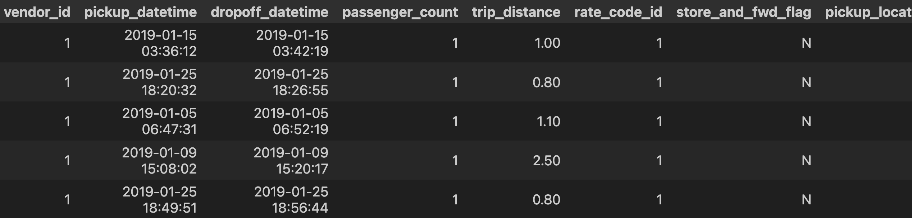
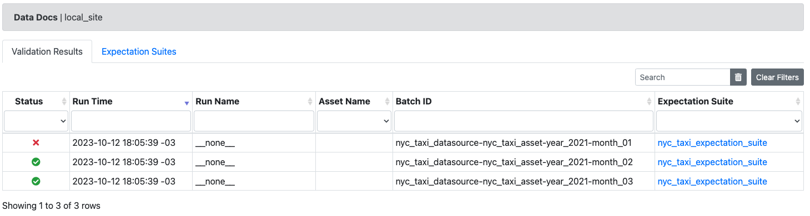

# fer-gx-multi-batch

Validate multiple batches of data sources using Great Expectations Python Library.

# Project context

This project is intended as a way to get to know "Great Expectations" Python library. It will rely on data coming from the `NCY taxi data` ( https://www.nyc.gov/site/tlc/about/tlc-trip-record-data.page ).

## What can be achived?

By running the notebooks in this order:

- a_file_data_context.ipynb

- b_connect_to_source_data.ipynb

- c_create_expectation_suite.ipynb

- d_validate_multiple_batches.ipynb

You will get the results of validating multiple batches of a dataset against a criterion. The pattern can be applied to build a testing suite against data assets in your pipeline, being them source data as well as transformed data.

### Example:

#### Data source asset

#### What to expect from that asset

- Expect column `fare_amount` values to be between `5.0` and `100.0` at least for `90%` of the records in each batch.

#### What we get from running validations

**Validation Results for every batch**

Notice that every batch ID has a `year_` and a `month_` prefix before year value and month value respectively. `year` and `month` are the names we defined for the `group names` when we created the asset.

**Batch 2021-01: More than 10% of `fare_amount` column values lie outside of the expected value range** Expectation was intentionally made to generate unexpected values

**Batch 2021-02: Less than 10% of `fare_amount` column values lie outside of the expected value range**

Batch 2021-03 also has less than 10% of `fare_amount` column values lying outside of the expected value range.

## Notebooks and their content

I separated the scripts into four different files in order to assure things are getting saved to the context (Context and other terms are explained below). The scripts and their function are as follows:

### a_file_data_context.ipynb

This notebook contains code for:

1) Install all the requirements.

2) The creation of a data context that is persistent across python sessions. "One of the primary responsibilities of the DataContext is managing CRUD operations for core GX objects" .(GX = Great Expectations).

### b_connect_to_source_data.ipynb

This notebook contains code for:

1) The creation of the `nyc_taxi_datasource` data source.

2) The creation of one asset for the data source called `nyc_taxi_asset`. The asset is composed by multiple batches (Multiple files).

### c_create_expectation_suite.ipynb

This notebook contains code for:

1) The creation of an expectation suite. An Expectation Suite is the placeholder for all the things you expect a certain data asset to conform to. Those things you expect are called Expectations.

    In this case, the expectation suite has the following expectation:

    - expect_column_values_to_be_between

2) Saving of the created expectation suite into the persistent context.

### d_validate_multiple_batches.ipynb

This notebook contains code for:

1) The creation of a batch request with multiple batches.

2) The creation of a validation list based on the batch request. Multiple files are going to be validated against the same Expectation Suite.

3) Run the validation.

4) Build and open the `Data Docs` in a browser. `Data Docs` are automatically generated by Great Expectations and show the Validation Results in a User friendly HTML presentation.

## Virtual environment

Python version: 3.11.4

Great expectations version: 0.17.12

The `gxmbvenv` virtual environment has been created to control the environment dependencies and added to .gitignore to prevent it from beeing copied to the repository.
`requirements.txt` will contain the required modules and versions for this project.

To install dependencies for this project run:

`pip install -r requirements.txt`

# What I learned

Great expectations library allows the validation of assets composed of multiple files (Partitioned asset). In our case those files have a naming convention that allows the use of a Regular Expression to match all the files belonging to an asset.